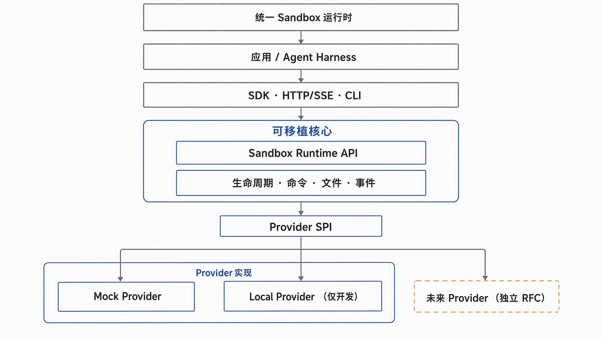

# Sandbox Runtime API

[](https://github.com/capa-cloud/sandbox-runtime-api/actions/workflows/ci.yml)
[](LICENSE)

<p align="center">
  <a href="README.md">English</a> | <strong>简体中文</strong>
</p>

Sandbox Runtime API `v0.1` 是一个独立设计、Provider 中立的公共契约，用于创建、观察、控制和删除
面向 AI Agent 与开发工具的隔离执行环境。

项目只标准化可移植的生命周期和能力语义。它不是托管 Sandbox 平台，不是 Agent 框架，也不是
任何私有系统的开源发行版。



SDK、HTTP/SSE 和 CLI 最终汇入同一个可移植 Runtime；具体实现隐藏在唯一 Provider SPI 后面。
虚线的未来 Provider 只是扩展方向，不属于 v0.1 已交付能力。

## 解决什么问题

Agent 应用通常需要相似的执行能力，但不同 Provider 对生命周期、就绪、命令、文件、终端、
网络、持久化和恢复提供了不同接口。本项目把这些问题拆分为：

- 带版本的 Sandbox 资源模型和生命周期；
- 具有显式能力协商的 Provider SPI；
- 可嵌入的内存参考 Runtime；
- 确定性的 Mock Provider；
- Provider 一致性测试；
- 已提供的 HTTP/SSE 映射、TypeScript 客户端 SDK 和开发 CLI。

## 与 Harness Runtime API 的关系

[`harness-runtime-api`](https://github.com/capa-cloud/harness-runtime-api) 规范应用如何控制 Agent
Harness 执行；Sandbox Runtime API 规范 Harness 或工具运行所需的隔离计算环境。

二者没有强制依赖。需要同时获得 Harness 与 Sandbox 可移植性时，可以组合使用。

## v0.1 能力

`0.1.0` 包含：

- 规范化 Runtime 模型、协议、能力词表与 OpenAPI；
- capability preflight；
- 幂等生命周期、reconcile、generation fencing 与重建；
- 有界命令执行和 Sandbox 相对路径文件操作；
- 追加事件列表与 SSE 投影；
- 内存 Runtime、TypeScript SDK、CLI 和 loopback 参考服务；
- Mock Provider 与不提供安全隔离的 Local Provider；
- Provider conformance runner；
- 公开来源与 clean-room 贡献规则。

协议在 `1.0.0` 前可能发生不兼容变化。Local Provider 不是安全 Sandbox，禁止执行不可信代码。

## 快速开始

开发环境要求 Node.js 22.12+（22.x）或 24.x，pnpm 10。CI 验证这两个版本线。

```bash
pnpm install
pnpm check
pnpm build
```

继续阅读 [快速开始](docs/quickstart.md) 或 [文档索引](DOCS-INDEX.md)。

## Clean-room 边界

本仓库只基于公开规范、公开仓库和通用分布式系统原则独立设计。禁止提交私有代码、私有 API、
内部标识、部署配置、生产数据或非公开测试用例。

贡献前请阅读 [来源与 provenance](ORIGIN_AND_PROVENANCE.md)、
[Clean-room policy](docs/clean-room-policy.md) 和 [非目标](NON_GOALS.md)。

## License

Apache License 2.0。
