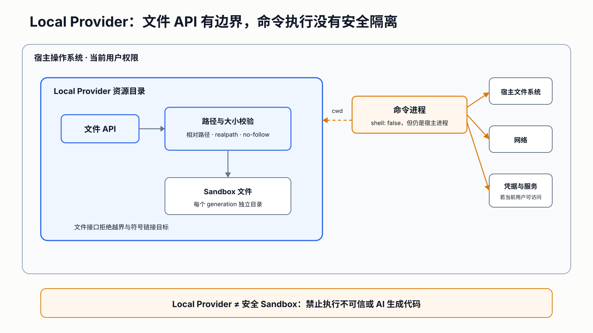

# Local Provider

## Purpose

The Local Provider is a deterministic development adapter for protocol, SDK, and conformance tests.
It creates one temporary working directory per sandbox generation and executes argument vectors with
Node.js `spawn` and `shell: false`.

## Security warning

The Local Provider is **not a security sandbox**. A command is an ordinary process owned by the current
OS user and can access resources allowed to that user. Filesystem API paths are confined to the
working directory, but command arguments are not a kernel security boundary.

Never run untrusted or AI-generated code with this Provider.

Text equivalent: file API requests pass sandbox-relative path, real-path, symbolic-link, and size
checks before reaching files inside one generation directory. Commands start with that directory as
their working directory but remain ordinary host processes and may access anything available to the
current OS user.

## Implemented capability

- bounded non-interactive command execution;
- UTF-8 stdout/stderr capture;
- timeout and abort termination;
- sandbox-relative regular-file read/write;
- one-directory listing;
- resource cleanup and clean generation recreation.

The Provider rejects image and template fields because it does not build or isolate an image.

## Filesystem protections

File operations reject:

- absolute or empty paths;
- lexical `..` escape;
- existing paths whose real path escapes the sandbox directory;
- symbolic-link entries and symbolic-link write targets;
- files above the configured byte limit;
- malformed base64 input.

These controls protect the file API contract. They do not constrain a spawned command.
