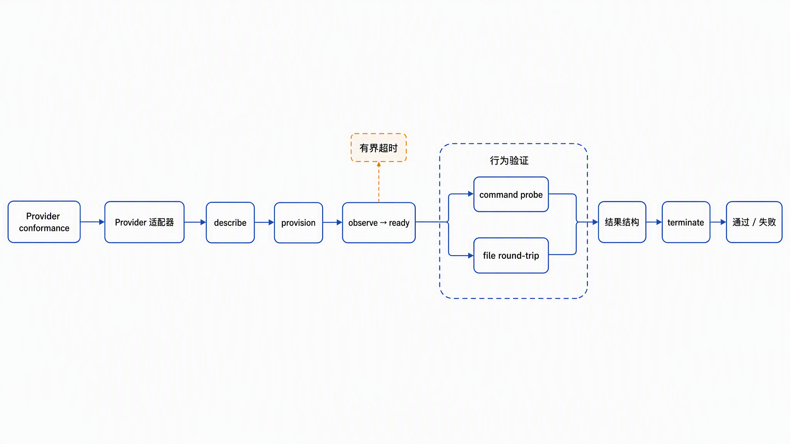

# Testing and Provider Conformance

## Required local gates

```bash
pnpm check
pnpm build
pnpm sanitize
pnpm docs:check
pnpm test:coverage
pnpm pack:check
pnpm audit:dependencies
```

`pnpm check` runs formatting, lint, type checking, the complete test suite, documentation validation,
build, coverage thresholds, and actual tarball validation. The package gate checks exports, CLI,
documentation, and every packaged Markdown local link, including image assets.
The package gate also performs an isolated install, compiles the packaged Mock example, and runs the
actual SDK/CLI through command, files, SSE, recreation, fencing, and shutdown cleanup.
CI runs the same gates on Node.js 22 and 24. The final check gate audits all dependencies, including
development tooling,
against high-severity advisories and requires registry access. CI then runs the public-content scan
and a separate production dependency audit.

## Test dimensions

| Dimension | Coverage |
| --- | --- |
| Unit and boundary | validation, lifecycle, errors, event cursors |
| Invariant | concurrent idempotent create and serialized termination |
| Provider contract | manifest-to-method consistency, lifecycle, command and file round-trip |
| Local integration | process execution, timeout, output bound, cleanup |
| HTTP and SDK | lifecycle, files, commands, SSE, error mapping |
| Security-negative | lexical and symbolic-link traversal, malformed input, non-loopback bind |
| Public safety | credentials, private networks, absolute paths, tracked-content scan |

## Conformance runner



`runProviderConformance(provider, options)` checks behavior declared by the Provider manifest. A
Provider that declares `commandExecution` must supply `options.commandRequest` with a safe command
known to exist in that runtime; the portable core does not assume POSIX utilities or a particular
language runtime. Each invocation uses unique synthetic resource and create-intent identities and
attempts bounded cleanup after every provisioning attempt, including a lost response. A failed
check means the Provider must not claim compatibility. Passing conformance does not certify isolation,
production availability, or performance.

Text equivalent: each run uses a unique synthetic resource, validates `describe`, `provision`, and
bounded readiness, checks declared command and file behavior as independent cases, validates complete
result shapes, and calls `terminate` before reporting pass or fail. Pause and resume must return
`paused` and `ready` respectively; later data-plane probes are skipped after an ambiguous lifecycle
failure. Cleanup is successful only when termination returns `terminated`.

```ts
const results = await runProviderConformance(provider, {
  operationTimeoutMs: 5_000,
  readinessTimeoutMs: 5_000,
  cleanupTimeoutMs: 5_000,
  pollIntervalMs: 25,
  commandRequest: { argv: ['safe-provider-specific-probe'] },
})
```

Each Provider call has a bounded deadline and receives an `AbortSignal`. Readiness shares one
deadline across all observations; cleanup has its own budget even after another call times out.
Timeout and poll values must be positive integers no larger than `2147483647`. Invalid options fail
before any Provider call. These are per-operation budgets, not one total run budget: a full run is
bounded by at most eight operation budgets, one readiness budget, and one cleanup budget.

Timeouts stop waiting, not arbitrary Provider work. Providers must honor cancellation and make
termination idempotent, including for an unknown resource. A timed-out provisioning call may allocate
after cleanup if cancellation is ignored; failed cleanup or late allocation requires Provider-side
reconciliation and must not be described as successful cleanup.

Vitest and its coverage package are pinned to the same version and upgraded together by Dependabot.
The Biome configuration schema must also match the installed Biome version.

Provider-specific real-account tests must be opt-in, use environment-provided credentials, and stay
outside default CI.
