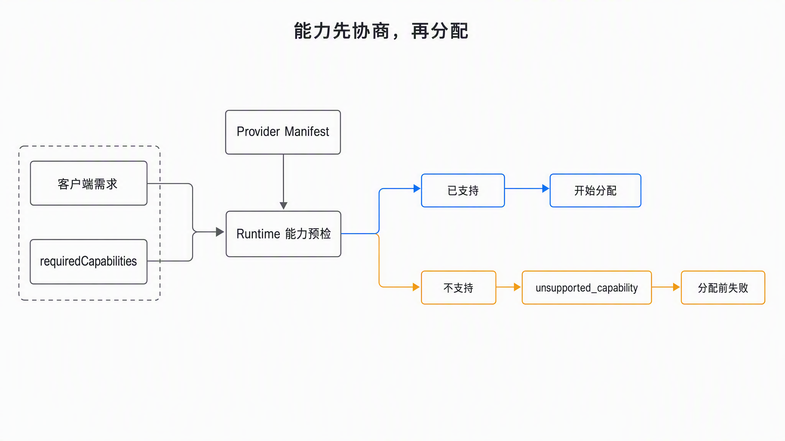

# Capabilities

Capabilities let a client reject an unsuitable provider before allocating resources.

Text equivalent: the runtime compares `requiredCapabilities` with the `Provider Manifest` before
allocation. A supported request proceeds; an unsupported request returns
`unsupported_capability` without allocating a resource.

Initial vocabulary:

| Capability | Meaning |
| --- | --- |
| `commandExecution` | Run bounded non-interactive commands |
| `fileAccess` | Read and write files through the runtime contract |
| `interactiveTerminal` | Open an interactive terminal or PTY |
| `portForwarding` | Expose a sandbox-local port through a provider endpoint |
| `pauseResume` | Suspend and later resume one logical generation |
| `filesystemSnapshot` | Capture and restore filesystem state |
| `memorySnapshot` | Capture and restore process memory state |
| `persistentVolume` | Attach storage whose lifetime is independent from one allocation |
| `networkPolicy` | Enforce declared ingress or egress policy |
| `imageReference` | Provision from a portable image reference |
| `templateReference` | Provision from a Provider-defined reusable template reference |
| `resourceLimits` | Enforce requested CPU, memory, and disk bounds |

A `true` value means the provider implements the portable semantics and is expected to pass the
matching conformance checks. It does not certify the isolation implementation or production SLO.
