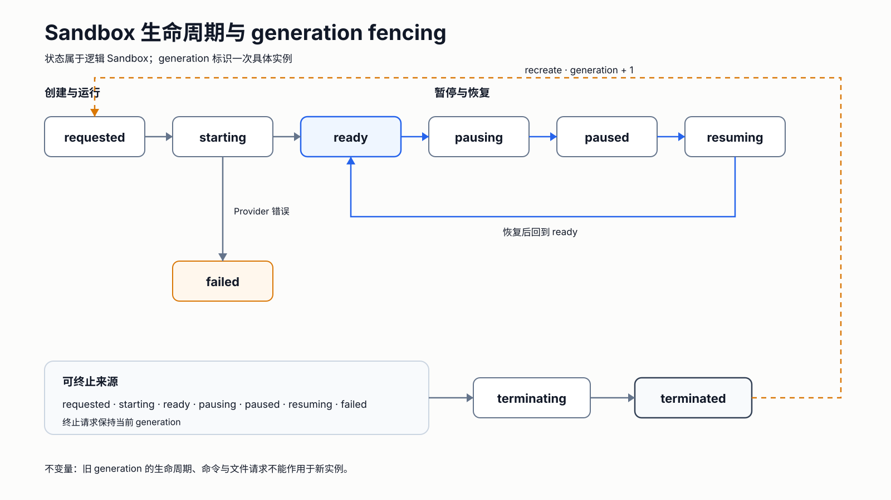

# Runtime Model

## Resource identity

A sandbox has two identities:

- `id`: stable logical identity chosen by the runtime;
- `generation`: monotonically increasing incarnation used to fence mutations.

Clients must present the observed generation when they perform destructive or state-changing
operations. A stale generation fails with `generation_conflict`.

## Lifecycle

The portable development states are shown below.

Text equivalent: creation follows `requested -> starting -> ready`; pause and resume follow
`ready -> pausing -> paused -> resuming -> ready`; Provider failures may enter `failed`. Any
non-terminal operational state may enter `terminating -> terminated`. Only recreation moves a
terminated logical resource to `requested` with `generation + 1`.

Allocation and readiness are separate observations. A provider may allocate a resource before its
execution agent or health endpoint is ready.

## Desired and observed state

The runtime owns portable desired state. Providers return observed resource identity, state, and
endpoint metadata. Provider payloads remain under a namespaced extension object and do not become
portable guarantees.

## Idempotency

`clientRequestId` identifies one create intent. Repeating the same create request returns the same
logical sandbox generation. Reusing it with a different specification, or replaying an older
generation's key after recreation, fails with `idempotency_conflict`.

## Capability preflight

Clients may declare required capabilities. The runtime rejects unsupported requirements before
provider allocation. Capabilities describe supported semantics; they do not prove security or
provider health.

## Reconciliation

Provider operations may complete even when a caller loses the response. The runtime therefore
supports repeated observation and reconciliation. A provider must return stable observed identity
for a given logical generation.

## Security boundary

The portable model does not claim a particular isolation strength. A provider manifest describes
its runtime class and declared features, while deployments own trust decisions and verification.
